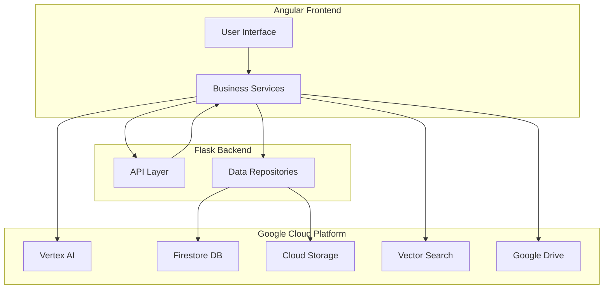
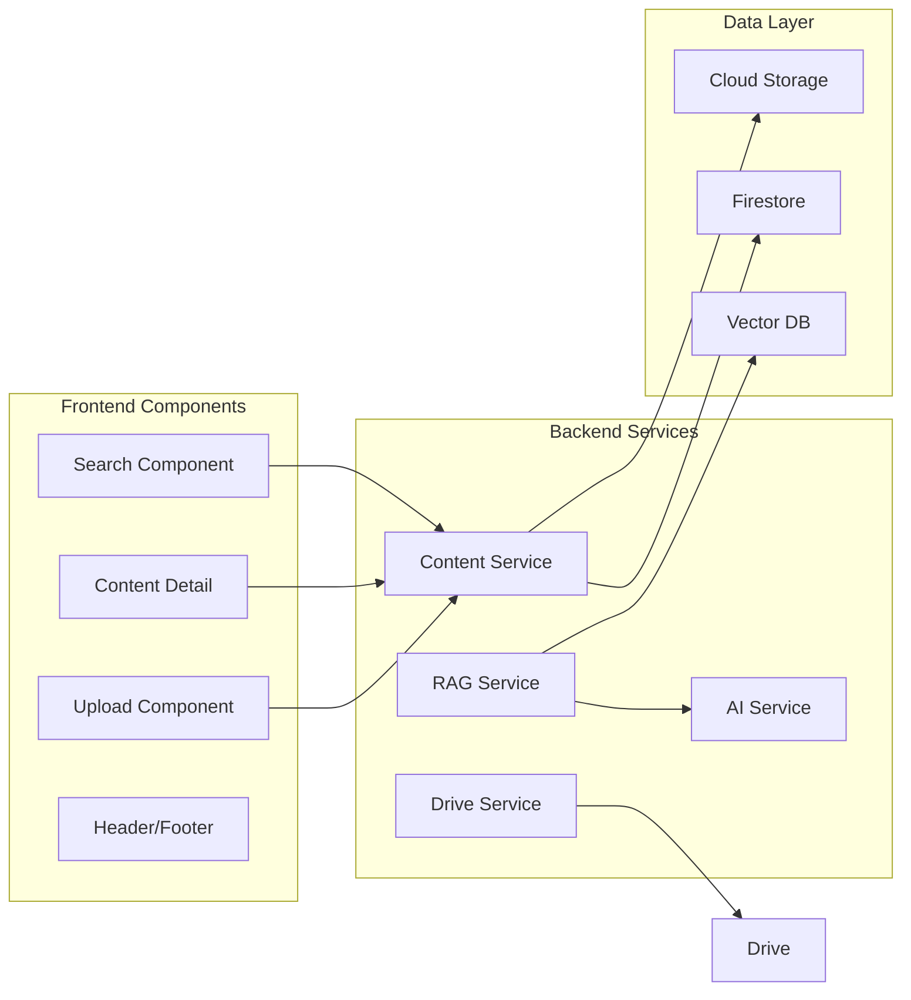
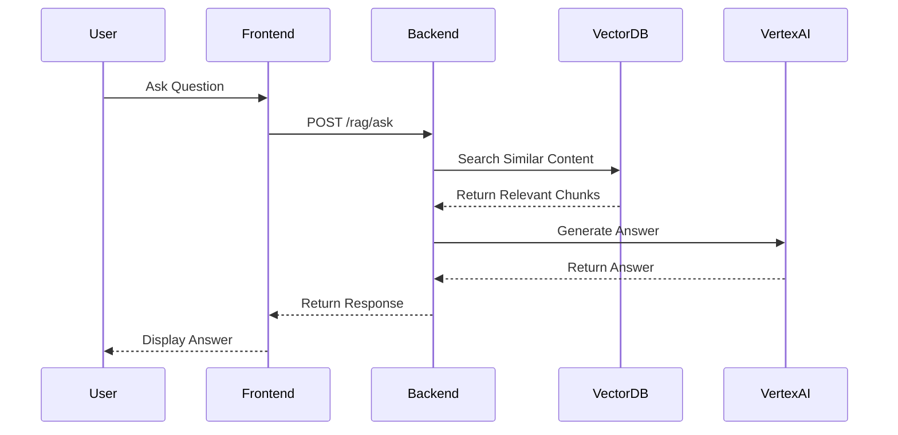
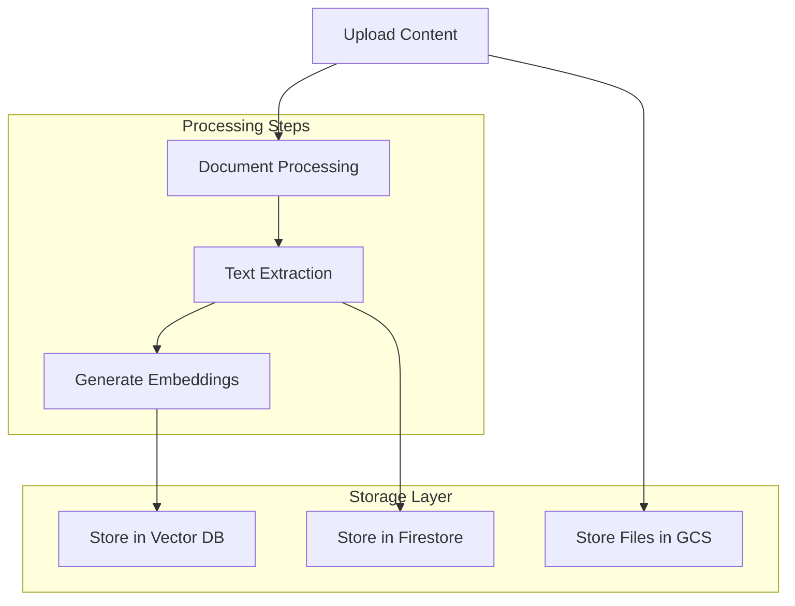
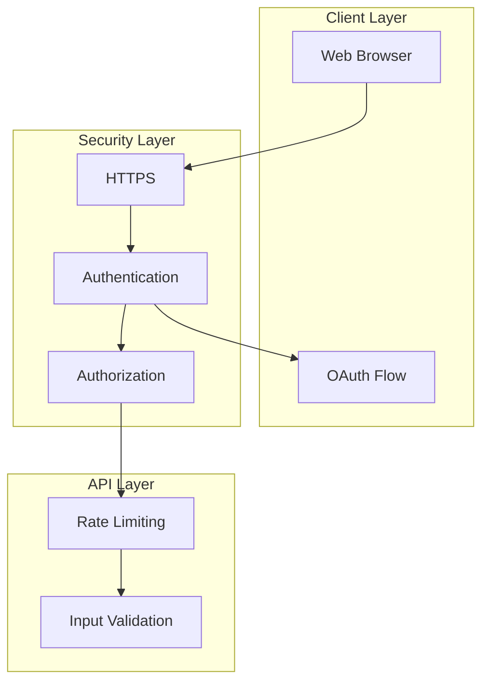
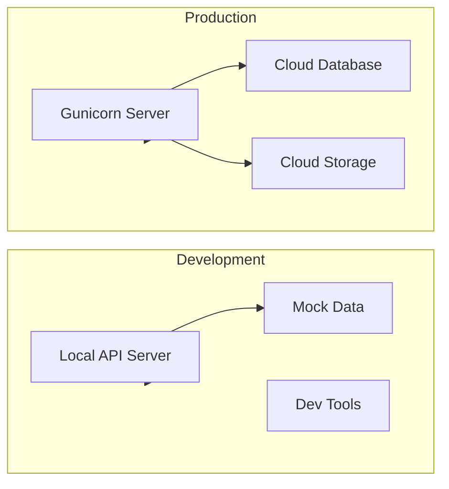

# Conference CMS Architecture Diagrams

## 1. High-Level System Architecture

## 2. Component Architecture

## 3. Data Flow for RAG Features

## 4. Content Processing Pipeline

## 5. Security Architecture

## 6. Development vs Production Environment

